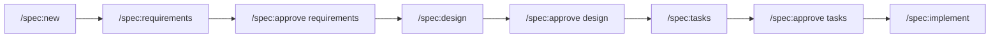
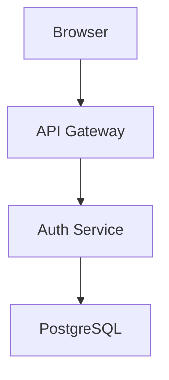
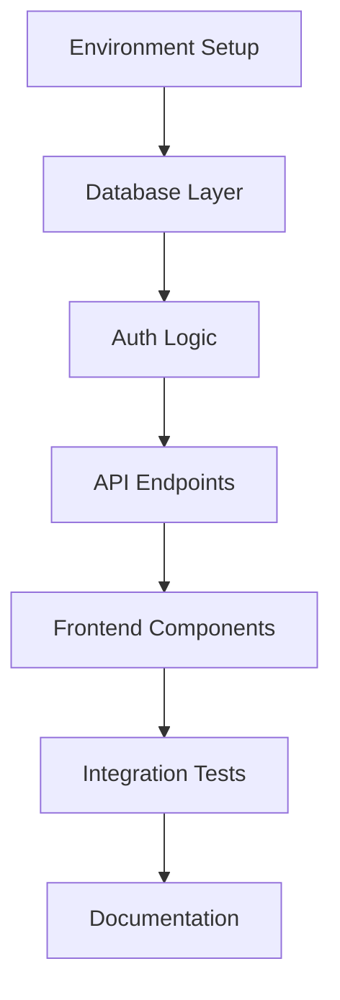

# Claude Code Spec-Driven Development Implementation Guide

## Table of Contents
1. [Overview](#overview)
2. [Benefits](#benefits)
3. [Prerequisites](#prerequisites)
4. [Quick Start](#quick-start)
5. [Installation](#installation)
6. [Command Reference](#command-reference)
7. [Workflow Example](#workflow-example)
8. [Templates](#templates)
9. [Best Practices](#best-practices)
10. [Troubleshooting](#troubleshooting)
11. [Advanced Usage](#advanced-usage)

## Overview

This guide implements a spec-driven development workflow in Claude Code using custom slash commands. The workflow enforces a structured approach where specifications are created, reviewed, and approved before implementation begins.

### Core Concept

Each feature is developed through four sequential phases:

1. **Requirements** - Define WHAT needs to be built
2. **Design** - Determine HOW it will be built  
3. **Tasks** - Plan WHEN and in what order
4. **Implementation** - Execute the plan with progress tracking

### File Structure

```
/spec/
├── 001-user-authentication/
│   ├── requirements.md
│   ├── design.md
│   └── tasks.md
├── 002-payment-integration/
│   ├── requirements.md
│   ├── design.md
│   └── tasks.md
└── .current-spec  # Stores the full spec directory name, e.g. 001-user-authentication
```

## Benefits

- **🎯 Catch problems early** - Identify and resolve requirement ambiguities before coding
- **🎮 Maintain control** - Review and approve each phase before proceeding
- **🔄 Iterate safely** - Modify specifications without losing conversation context
- **🧠 Keep AI focused** - Separate planning from coding for better results
- **👥 Enable collaboration** - Living documentation for team reviews
- **📚 Build knowledge** - Document decisions and preserve context

## Prerequisites

- Claude Code installed and configured
- Git repository initialized
- Basic understanding of markdown

## Quick Start

```bash
# 1. Set up the spec workflow (see Installation)
mkdir -p .claude/commands/spec
mkdir -p spec

# 2. Create your first spec
/spec:new user-authentication

# 3. Follow the workflow
/spec:requirements      # Create requirements
/spec:approve requirements  # Mark as approved
/spec:design           # Create design
/spec:approve design   # Mark as approved  
/spec:tasks            # Create task list
/spec:approve tasks    # Mark as approved
/spec:implement        # Start coding
```

## Installation

### Step 1: Create Directory Structure

```bash
# Create directories for spec commands
mkdir -p .claude/commands/spec
mkdir -p spec

# Create a file to track current spec
echo "" > spec/.current-spec
```

### Step 2: Create Spec Commands

#### `/spec:new` - Initialize New Specification

Create `.claude/commands/spec/new.md`:

```markdown
---
allowed-tools: Bash(mkdir:*), Bash(echo:*), Bash(date:*), Bash(ls:*)
description: Create a new feature specification
argument-hint: <feature-name>
---

## Current Spec Status

!`ls -la spec/ 2>/dev/null | grep "^d" | wc -l | xargs -I {} echo "Total specs: {}"`

## Your Task

Create a new specification directory for the feature: $ARGUMENTS

1. Determine the next ID number (format: 001, 002, etc.)
2. Create directory: `spec/[ID]-$ARGUMENTS/`
3. Update `spec/.current-spec` with the new spec directory name ([ID]-$ARGUMENTS)
4. Create a README.md in the new directory with:
   - Feature name
   - Creation date
   - Initial status checklist
5. Inform the user about next steps

Use the Bash tool to create directories and files as needed.
```

#### `/spec:requirements` - Generate Requirements Template

Create `.claude/commands/spec/requirements.md`:

```markdown
---
allowed-tools: Bash(cat:*), Bash(test:*), Bash(touch:*), Write
description: Create or review requirements specification
---

## Context

Current spec: !`cat spec/.current-spec 2>/dev/null || echo "No active spec"`
Spec directory contents: !`ls -la spec/$(cat spec/.current-spec 2>/dev/null)/ 2>/dev/null || echo "Spec not found"`

## Your Task

For the current active specification:

1. Check if requirements.md exists
2. If not, create a comprehensive requirements.md with:
   - Feature overview
   - User stories with acceptance criteria
   - Functional requirements (P0, P1, P2)
   - Non-functional requirements
   - Constraints and assumptions
   - Out of scope items
   - Success metrics
3. If it exists, display current content and suggest improvements
4. Remind user to use `/spec:approve requirements` when ready

Use the Write tool to create/update the requirements.md file.
```

#### `/spec:design` - Generate Design Document

Create `.claude/commands/spec/design.md`:

```markdown
---
allowed-tools: Bash(cat:*), Bash(test:*), Bash(ls:*), Write
description: Create technical design specification
---

## Context

Current spec: !`cat spec/.current-spec 2>/dev/null`
Requirements approved: !`test -f spec/$(cat spec/.current-spec)/.requirements-approved && echo "Yes" || echo "No"`
Current directory: !`ls -la spec/$(cat spec/.current-spec)/ 2>/dev/null`

## Your Task

1. Verify requirements are approved (look for .requirements-approved file)
2. If not approved, inform user to complete requirements first
3. If approved, create/update design.md with:
   - Architecture overview (with diagrams)
   - Technology stack decisions
   - Data model and schema
   - API design
   - Security considerations
   - Performance considerations
   - Deployment architecture
   - Technical risks and mitigations
4. Use ASCII art or mermaid diagrams where helpful

Use the Write tool to create the design document.
```

#### `/spec:tasks` - Generate Task List

Create `.claude/commands/spec/tasks.md`:

```markdown
---
allowed-tools: Bash(cat:*), Bash(test:*), Write
description: Create implementation task list
---

## Context

Current spec: !`cat spec/.current-spec 2>/dev/null`
Design approved: !`test -f spec/$(cat spec/.current-spec)/.design-approved && echo "Yes" || echo "No"`

## Your Task

1. Verify design is approved
2. Create tasks.md with:
   - Overview with time estimates
   - Phase breakdown (Foundation, Core, Testing, Deployment)
   - Detailed task list with checkboxes
   - Task dependencies
   - Risk mitigation tasks
3. Each task should be specific and actionable
4. Use markdown checkboxes: `- [ ] Task description`

Organize tasks to enable incremental development and testing.
```

#### `/spec:approve` - Approve Specification Phase

Create `.claude/commands/spec/approve.md`:

```markdown
---
allowed-tools: Bash(touch:*), Bash(test:*), Bash(cat:*)
description: Approve a specification phase
argument-hint: requirements|design|tasks
---

## Context

Current spec: !`cat spec/.current-spec 2>/dev/null`
Spec directory: !`ls -la spec/$(cat spec/.current-spec)/ 2>/dev/null`

## Your Task

For the phase "$ARGUMENTS":

1. Verify the phase file exists (requirements.md, design.md, or tasks.md)
2. Create approval marker file: `.${ARGUMENTS}-approved`
3. Inform user about next steps:
   - After requirements → design phase
   - After design → tasks phase
   - After tasks → implementation
4. If invalid phase name, show valid options

Use touch command to create approval markers.
```

#### `/spec:status` - Show Specification Status

Create `.claude/commands/spec/status.md`:

```markdown
---
allowed-tools: Bash(ls:*), Bash(cat:*), Bash(grep:*), Bash(test:*), Bash(find:*)
description: Show all specifications and their status
---

## Gather Status Information

All specs: !`ls -d spec/*/ 2>/dev/null | sort`
Current spec: !`cat spec/.current-spec 2>/dev/null || echo "None"`

For each spec directory, check:
!`for dir in spec/*/; do
    if [ -d "$dir" ]; then
        echo "=== $dir ==="
        ls -la "$dir" | grep -E "(requirements|design|tasks)\.md|\..*-approved"
        if [ -f "$dir/tasks.md" ]; then
            echo "Task progress:"
            grep "^- \[" "$dir/tasks.md" | head -5
            echo "Total tasks: $(grep -c "^- \[" "$dir/tasks.md" 2>/dev/null || echo 0)"
            echo "Completed: $(grep -c "^- \[x\]" "$dir/tasks.md" 2>/dev/null || echo 0)"
        fi
        echo ""
    fi
done`

## Your Task

Present a clear status report showing:
1. All specifications with their IDs and names
2. Current active spec (highlighted)
3. Phase completion status for each spec
4. Task progress percentage if applicable
5. Recommended next action for active spec
```

#### `/spec:implement` - Start Implementation Session

Create `.claude/commands/spec/implement.md`:

```markdown
---
allowed-tools: Bash(cat:*), Bash(test:*), Bash(grep:*), Write
description: Start implementation from approved tasks
argument-hint: [phase-number]
---

## Context

Current spec: !`cat spec/.current-spec 2>/dev/null`
Tasks approved: !`test -f spec/$(cat spec/.current-spec)/.tasks-approved && echo "Yes" || echo "No"`

## Current Tasks

!`if [ -f "spec/$(cat spec/.current-spec)/tasks.md" ]; then
    echo "=== Phase Overview ==="
    grep "^## Phase" "spec/$(cat spec/.current-spec)/tasks.md"
    echo ""
    echo "=== Incomplete Tasks ==="
    grep "^- \[ \]" "spec/$(cat spec/.current-spec)/tasks.md" | head -20
fi`

## Your Task

1. Verify all phases are approved
2. If phase number provided ($ARGUMENTS), focus on that phase
3. Display current incomplete tasks
4. Create an implementation session log
5. Guide user to:
   - Work on tasks sequentially
   - Update task checkboxes as completed
   - Commit changes regularly
6. Remind about using Write tool to update tasks.md

Start implementing based on the task list!
```

#### `/spec:switch` - Switch Active Specification

Create `.claude/commands/spec/switch.md`:

```markdown
---
allowed-tools: Bash(ls:*), Bash(echo:*), Bash(test:*)
description: Switch to a different specification
argument-hint: <spec-id>
---

## Available Specifications

!`ls -d spec/*/ 2>/dev/null | sort`

## Your Task

Switch the active specification to: $ARGUMENTS

1. Verify the spec directory exists
2. Update spec/.current-spec with the new spec directory name ([ID]-$ARGUMENTS)
3. Show the status of the newly active spec
4. Display next recommended action

If no argument provided, list all available specs.
```

### Step 3: Create Helper Commands (Optional)

#### `/spec:update-task` - Update Task Status

Create `.claude/commands/spec/update-task.md`:

```markdown
---
allowed-tools: Bash(cat:*), Bash(grep:*), Write
description: Mark a task as complete
argument-hint: <task-description-or-number>
---

## Current Tasks

!`cat spec/$(cat spec/.current-spec)/tasks.md | grep -n "^- \[" | head -20`

## Your Task

Update the task status for: "$ARGUMENTS"

1. Find the matching task in tasks.md
2. Change `- [ ]` to `- [x]` for that task
3. Show updated progress statistics
4. Suggest next task to work on

Use the Write tool to update the file.
```

#### `/spec:review` - Review Current Phase

Create `.claude/commands/spec/review.md`:

```markdown
---
allowed-tools: Bash(cat:*), Bash(test:*)
description: Review current specification phase
---

## Current Spec Status

!`current=$(cat spec/.current-spec 2>/dev/null)
if [ -n "$current" ]; then
    echo "Active spec: $current"
    echo "Files present:"
    ls -la "spec/$current/" | grep -E "(requirements|design|tasks)\.md"
    echo ""
    echo "Approval status:"
    ls -la "spec/$current/" | grep "approved"
fi`

## Your Task

1. Identify which phase is currently active (not yet approved)
2. Display the content of that phase's document
3. Provide a review checklist:
   - Does it meet all criteria?
   - Is it complete and clear?
   - Any missing elements?
4. Remind user how to approve when ready
```

## Command Reference

### Core Commands

| Command | Description | Usage |
|---------|-------------|--------|
| `/spec:new` | Create a new specification | `/spec:new user-authentication` |
| `/spec:requirements` | Generate requirements template | `/spec:requirements` |
| `/spec:design` | Generate design template | `/spec:design` |
| `/spec:tasks` | Generate task list template | `/spec:tasks` |
| `/spec:approve` | Approve a specification phase | `/spec:approve requirements` |
| `/spec:implement` | Start implementation phase | `/spec:implement [phase]` |
| `/spec:status` | Show all specs and progress | `/spec:status` |
| `/spec:switch` | Switch active specification | `/spec:switch 001-user-auth` |
| `/spec:update-task` | Mark task as complete | `/spec:update-task "Create user model"` |
| `/spec:review` | Review current phase | `/spec:review` |

### Command Flow



## Workflow Example

### Complete Feature Development Flow

```bash
# Day 1: Specification
/spec:new user-authentication
# Creates: spec/001-user-authentication/

/spec:requirements
# Claude creates requirements.md template
# You edit and refine the requirements

/spec:approve requirements
# Creates .requirements-approved marker

# Day 2: Design
/spec:design  
# Claude creates design.md based on requirements
# You review and adjust the technical design

/spec:approve design
# Creates .design-approved marker

# Day 3: Planning
/spec:tasks
# Claude creates detailed task breakdown
# You review and adjust time estimates

/spec:approve tasks
# Creates .tasks-approved marker

# Day 4-10: Implementation
/spec:implement 1  # Focus on Phase 1
# Work through tasks, updating checkboxes

/spec:update-task "Initialize project repository"
# Claude marks task as complete

/spec:status  # Check overall progress
# See all specs and completion percentages
```

## Templates

### Requirements Template Structure

```markdown
# Requirements Specification

## Feature Overview
[High-level description of the feature]

## User Stories

### Story 1: [User can authenticate]
**As a** registered user  
**I want** to log in with my credentials  
**So that** I can access my personal dashboard

**Acceptance Criteria:**
- [ ] User can enter email and password
- [ ] System validates credentials
- [ ] Successful login redirects to dashboard
- [ ] Failed login shows error message

## Functional Requirements

### Must Have (P0)
- **REQ-001**: System must support email/password authentication
- **REQ-002**: Passwords must be hashed using bcrypt

### Should Have (P1)
- **REQ-003**: Support "Remember me" functionality
- **REQ-004**: Implement password reset via email

### Nice to Have (P2)
- **REQ-005**: Support OAuth providers (Google, GitHub)

## Non-Functional Requirements

### Performance
- Login response time < 500ms
- Support 1000 concurrent users

### Security
- Passwords minimum 8 characters
- Session timeout after 30 minutes
- HTTPS only

## Constraints and Assumptions

### Technical Constraints
- Must use existing user database
- Compatible with React frontend

### Assumptions
- Users have valid email addresses
- Email service is available

## Out of Scope
- Two-factor authentication
- Biometric authentication

## Success Metrics
- Login success rate > 95%
- Password reset completion > 80%
```

### Design Template Structure

```markdown
# Technical Design Specification

## Architecture Overview

### System Context



## Technology Stack

### Frontend
- **Framework**: React 18
- **State Management**: Context API
- **Styling**: TailwindCSS
- **Form Handling**: React Hook Form

### Backend
- **Runtime**: Node.js 20
- **Framework**: Express.js
- **Authentication**: JWT + bcrypt
- **Database**: PostgreSQL 15

## Data Model

### Users Table
```sql
CREATE TABLE users (
    id UUID PRIMARY KEY DEFAULT gen_random_uuid(),
    email VARCHAR(255) UNIQUE NOT NULL,
    password_hash VARCHAR(255) NOT NULL,
    created_at TIMESTAMP DEFAULT CURRENT_TIMESTAMP,
    last_login TIMESTAMP
);
```

### Sessions Table
```sql
CREATE TABLE sessions (
    id UUID PRIMARY KEY DEFAULT gen_random_uuid(),
    user_id UUID REFERENCES users(id),
    token_hash VARCHAR(255) NOT NULL,
    expires_at TIMESTAMP NOT NULL,
    created_at TIMESTAMP DEFAULT CURRENT_TIMESTAMP
);
```

## API Design

### POST /api/auth/login
**Request**:
```json
{
  "email": "user@example.com",
  "password": "securepassword"
}
```

**Response (200)**:
```json
{
  "token": "eyJhbGciOiJIUzI1NiIs...",
  "user": {
    "id": "123e4567-e89b-12d3-a456-426614174000",
    "email": "user@example.com"
  }
}
```

### POST /api/auth/logout
**Headers**: `Authorization: Bearer <token>`

**Response (200)**:
```json
{
  "message": "Logged out successfully"
}
```

## Security Considerations

### Password Storage
- Bcrypt with cost factor 12
- Never store plain text passwords

### JWT Configuration
- HS256 algorithm
- 15-minute access token expiry
- Secure, httpOnly cookies

### Rate Limiting
- 5 login attempts per IP per minute
- Exponential backoff for failed attempts

## Error Handling

### Standard Error Response
```json
{
  "error": {
    "code": "AUTH_INVALID_CREDENTIALS",
    "message": "Invalid email or password",
    "timestamp": "2024-01-20T10:30:00Z"
  }
}
```

## Technical Risks

| Risk | Impact | Probability | Mitigation |
|------|--------|-------------|------------|
| Database connection failure | High | Low | Connection pooling, retry logic |
| JWT secret exposure | Critical | Low | Environment variables, key rotation |
| Brute force attacks | Medium | Medium | Rate limiting, account lockout |
```

### Tasks Template Structure

```markdown
# Implementation Tasks

## Phase 1: Foundation Setup

### Development Environment
- [ ] Initialize Node.js project with TypeScript
- [ ] Set up ESLint and Prettier
- [ ] Configure Jest for testing
- [ ] Create docker-compose for PostgreSQL

### Project Structure
- [ ] Create src/ directory structure
- [ ] Set up environment variables
- [ ] Configure build scripts
- [ ] Initialize Git repository

## Phase 2: Backend Implementation

### Database Layer
- [ ] Create database migrations for users table
- [ ] Create database migrations for sessions table
- [ ] Implement database connection module
- [ ] Create user repository layer

### Authentication Logic
- [ ] Implement password hashing utilities
- [ ] Create JWT token generation/validation
- [ ] Build login endpoint
- [ ] Build logout endpoint
- [ ] Add session management

### Middleware
- [ ] Create authentication middleware
- [ ] Implement rate limiting
- [ ] Add request validation
- [ ] Set up error handling

## Phase 3: Frontend Integration

### Components
- [ ] Create login form component
- [ ] Add form validation
- [ ] Implement error displays
- [ ] Create loading states

### State Management
- [ ] Set up auth context
- [ ] Implement login action
- [ ] Handle token storage
- [ ] Add logout functionality

## Phase 4: Testing & Documentation

### Testing
- [ ] Write unit tests for auth utilities
- [ ] Test API endpoints
- [ ] Create integration tests
- [ ] Manual testing checklist

### Documentation
- [ ] API documentation
- [ ] Setup instructions
- [ ] Security guidelines
- [ ] Deployment notes

## Dependencies



## Definition of Done

Each task is considered complete when:
- Code is written and functional
- Unit tests pass
- Code review completed
- Documentation updated
```

## Best Practices

### 1. Phase Discipline
- ✅ Complete phases sequentially
- ✅ Review thoroughly before approval
- ✅ Keep approval markers in version control
- ❌ Don't skip phases
- ❌ Don't implement without approved specs

### 2. Documentation Standards
- ✅ Use clear, specific language
- ✅ Include concrete examples
- ✅ Add diagrams where helpful
- ❌ Avoid vague requirements
- ❌ Don't over-engineer early phases

### 3. Task Management
- ✅ Update task status immediately
- ✅ Keep tasks small and specific
- ✅ Include time estimates
- ✅ Group related tasks
- ❌ Don't batch status updates

### 4. Command Usage
- ✅ Use commands in sequence
- ✅ Review output before proceeding
- ✅ Keep spec/.current-spec updated
- ❌ Don't modify approval files manually

### 5. Version Control
```bash
# Good commit messages
git commit -m "spec(001): complete requirements phase"
git commit -m "spec(001): add security requirements"
git commit -m "impl(001): complete user model (tasks 3-5)"

# Include spec files in commits
git add spec/001-user-authentication/
git commit -m "spec(001): approve design phase"

# Branch naming
git checkout -b feature/001-user-authentication
git checkout -b spec/001-requirements
```

## Troubleshooting

### Common Issues and Solutions

#### "No active spec" Error
```bash
# Check current spec
cat spec/.current-spec

# If empty, set it manually
echo "001-user-authentication" > spec/.current-spec  # Use the full directory name

# Or use switch command
/spec:switch 001-user-authentication
```

#### Phase Not Approved
```bash
# Check approval status
ls -la spec/001-user-authentication/.*-approved

# Approve if ready
/spec:approve requirements
```

#### Tasks Not Updating
```bash
# Ensure you're using Write tool in Claude
# When updating tasks, be specific:
/spec:update-task "exact task description"

# Or manually edit and have Claude read
vi spec/001-user-authentication/tasks.md
```

#### Command Not Found
```bash
# Check command exists
ls .claude/commands/spec/

# Ensure .md extension
ls .claude/commands/spec/new.md

# Commands should appear in
/help
```

## Advanced Usage

### Creating Project Templates

Create reusable templates for common project types:

```bash
# Create template directory
mkdir -p .claude/templates/web-api

# Add template files
cp spec/001-user-authentication/requirements.md .claude/templates/web-api/
cp spec/001-user-authentication/design.md .claude/templates/web-api/
```

### Automated Status Reports

Create a status report command:

```markdown
# .claude/commands/spec/report.md
---
allowed-tools: Bash(find:*), Bash(grep:*), Bash(date:*)
description: Generate comprehensive spec report
---

Generate a markdown report showing:
- All specifications and their status
- Task completion percentages
- Timeline adherence
- Blocked items
- Next actions for each spec
```

### Integration with Issue Trackers

Link specs to GitHub issues:

```markdown
# In your spec files, reference issues
## Related Issues
- Implements: #123
- Fixes: #124, #125
- Related to: #126
```

### Multi-Phase Implementation

For large features, split implementation:

```bash
/spec:implement 1  # Complete Phase 1
# Commit and test

/spec:implement 2  # Move to Phase 2
# Continue iteratively
```

### Spec Archival

When specs are complete:

```bash
# Create archive directory
mkdir -p spec/archive/2024

# Move completed specs
mv spec/001-user-authentication spec/archive/2024/

# Update current spec if needed
echo "" > spec/.current-spec
```

## Tips for Success

1. **Start Small**: First spec should be a simple feature
2. **Be Specific**: Vague requirements lead to rework
3. **Review Often**: Check `/spec:status` regularly
4. **Commit Frequently**: Keep specs in version control
5. **Iterate**: Specs can evolve, but track changes
6. **Team Alignment**: Share specs for review before approval
7. **Learn and Adapt**: Refine templates based on experience

## Conclusion

This spec-driven workflow brings professional software development practices to AI-assisted coding. By separating planning from implementation and leveraging Claude Code's custom commands, you maintain control while maximizing productivity.

### Key Takeaways

1. **Structure enables creativity** - Clear specs let Claude focus on quality implementation
2. **Commands enforce discipline** - Slash commands guide the workflow naturally
3. **Documentation is automation** - Well-written specs reduce ambiguity
4. **Progress tracking builds confidence** - Always know where you are

### Next Steps

1. Install the commands in your project
2. Create your first spec with `/spec:new`
3. Follow the workflow for one complete feature
4. Refine templates based on your needs
5. Share with your team

---

*Happy spec-driven development with Claude Code!*